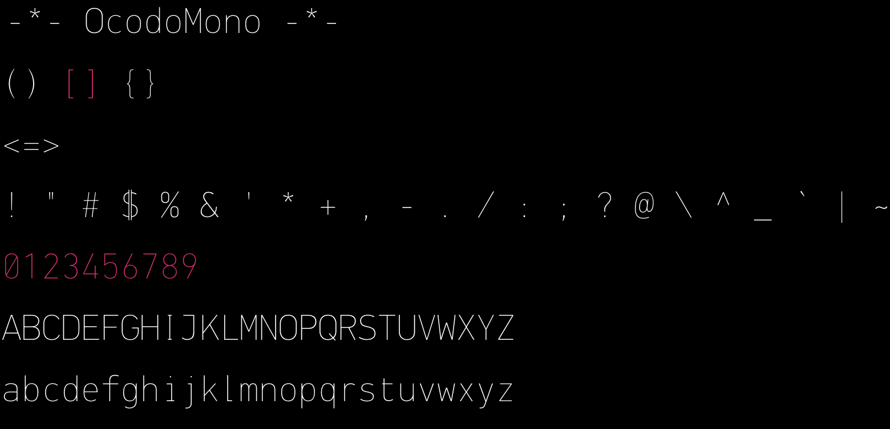
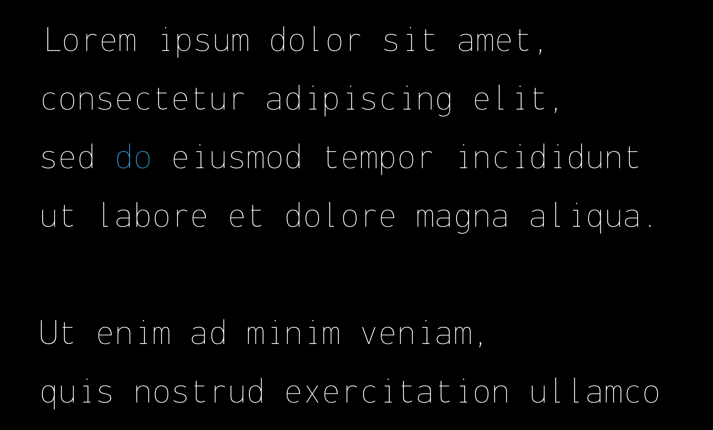
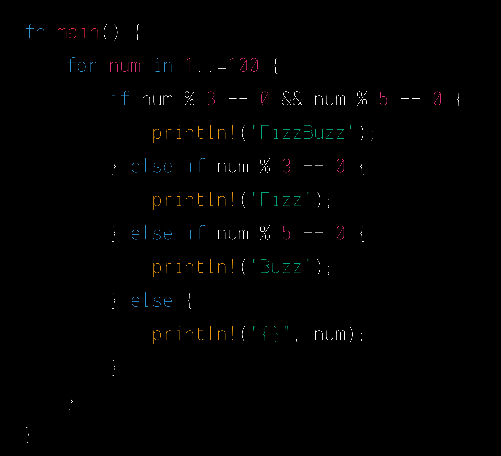
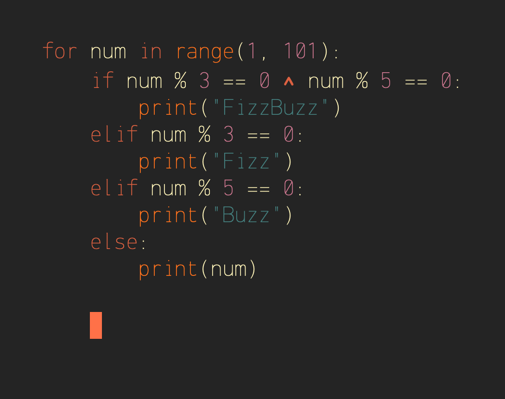
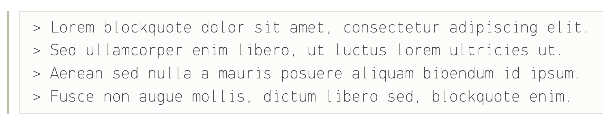
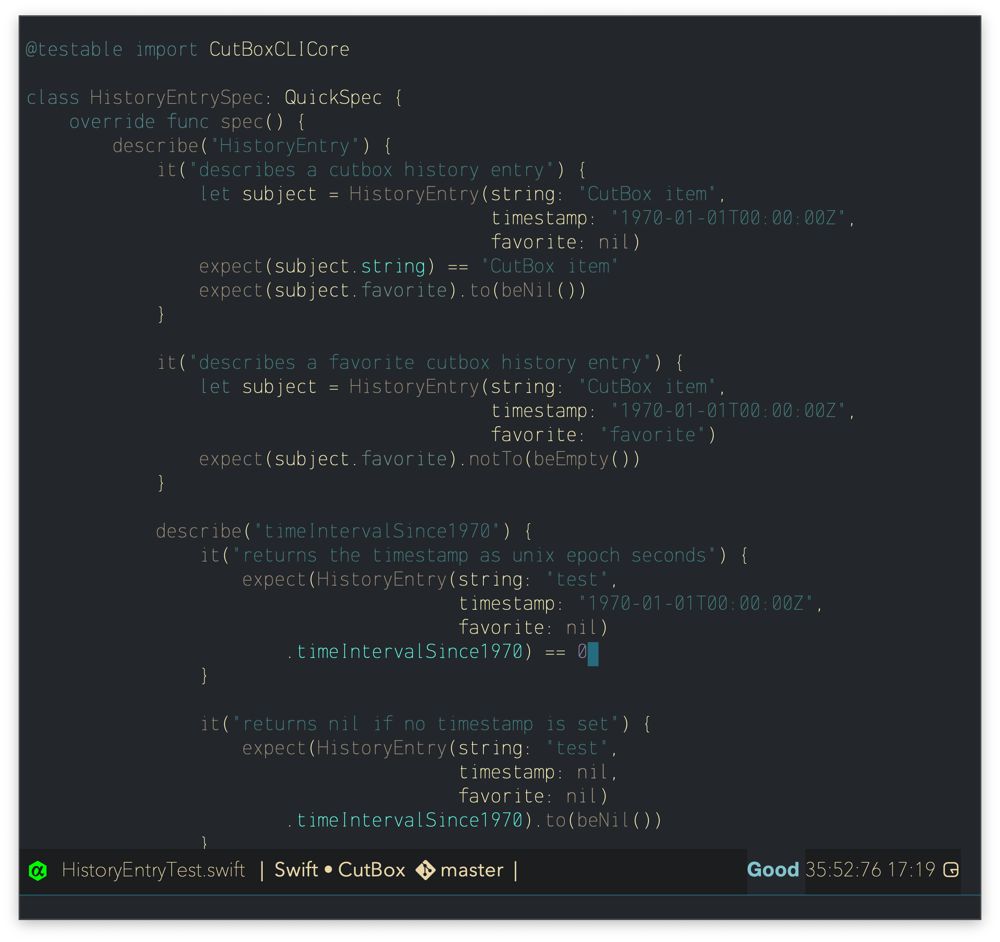

an ultrathin monospaced font based on DIN

- **Weight:**
  - : regular (appears thin)

- **Font Name(s):**
  - OcodoMono-Regular ttf/woff2
  - OcodoMono-Bold ttf/woff2
  - OcodoMonoNerdFont-Regular ttf/woff2
  - OcodoMonoNerdFont-Bold ttf/woff2

- **Inspired by:** FF DIN

### [Download](https://github.com/ocodo/ocodo-mono/releases/latest)

 This work is licensed under a <a rel="license" href="http://creativecommons.org/licenses/by-nc/2.5/">Creative Commons Attribution-NonCommercial 2.5 Generic License</a>.

**OcodoMono** is best suited for users who have a penchant for extreme dark mode aesthetics and value the minimalist elegance of an ultra-thin monospaced font.

Terminal/Editor comfort is the goal.

> **Note:** Firefox / Linux. The font hinting is poor at smaller sizes, leading to reduced clarity / legibility.  All other browser tests (including Firefox on Mac and Windows) had excellent results.

## Type Demos

